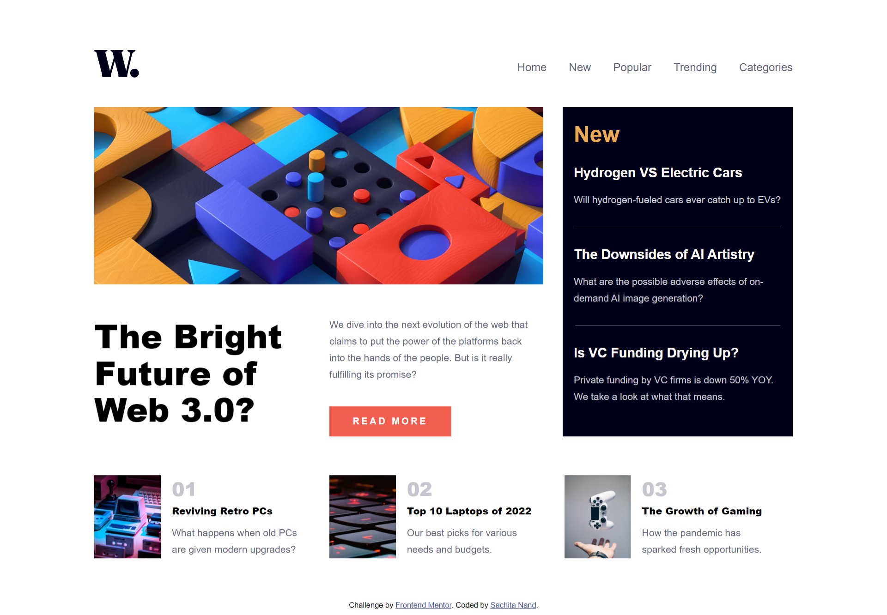
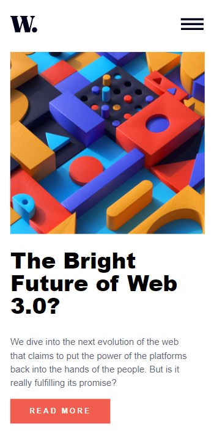
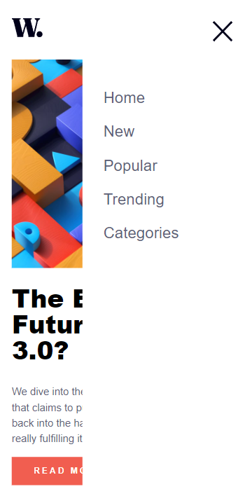

# Frontend Mentor - News homepage solution

This is a solution to the [News homepage challenge on Frontend Mentor](https://www.frontendmentor.io/challenges/news-homepage-H6SWTa1MFl).

## Table of contents

- [Overview](#overview)
  - [The challenge](#the-challenge)
  - [Screenshot](#screenshot)
  - [Links](#links)
- [My process](#my-process)
  - [Built with](#built-with)
  
  - [Useful resources](#useful-resources)
- [Author](#author)

## Overview

### The challenge

Users should be able to:

- View the optimal layout for the interface depending on their device's screen size
- See hover and focus states for all interactive elements on the page
- **Bonus**: Toggle the mobile menu (requires some JavaScript)

### Screenshot

<kbd></kbd>
<kbd></kbd><kbd></kbd>

### Links

- Solution URL: 
- Live Site URL:

## My process

### Built with

- Semantic HTML5 markup
- CSS custom properties
- Flexbox
- CSS Grid
- JavaScript

### Useful resources

- [MDN Web Docs](https://developer.mozilla.org/en-US/docs/Web/CSS) - This helped me for XYZ reason. I really liked this pattern and will use it going forward.

## Author

- Frontend Mentor - [@sachita-maker](https://www.frontendmentor.io/profile/sachita-maker)

**Have fun building!** 🚀
